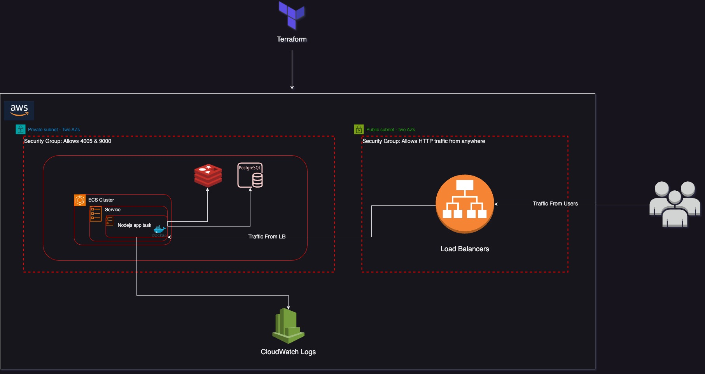

# Lifinance  Deployment infrastructure task

This repository houses the codebase for the Lifinance ECS (Elastic Container Service) infrastructure, pivotal in deploying and managing our NodeJS-based application.

# Infrastructure Overview
Lifinance's infrastructure is designed for high efficiency and scalability. The major components include:

- *ECS Cluster:* this the core of our infrastructure handling a service that manages numerous tasks. Each task encompasses a container dedicated to running the NodeJS application.
- *Load Balancer:* Ensures even distribution of incoming requests across tasks, optimizing response times and resource utilization.
- *PostgreSQL Database:* Provides robust data storage for the NodeJS application, ensuring data integrity and fast access.
- *Redis:* Employed for efficient caching, enhancing performance by reducing data retrieval times.
- *CloudWatch:* Integrated for comprehensive logging, enabling real-time monitoring and alerting for system health and performance.

## Continous Integration / Continous Deployment

Our CI/CD pipeline, facilitated by GitHub Actions, automates and streamlines our deployment process. Triggered by pushes to the main branch, it encompasses:

- *Dockerfile Linting:* Ensures adherence to best practices and standards in our Dockerfile configurations.
- *Docker Image Building:* Constructs a Docker image from the application and pushes it to AWS ECR (Elastic Container Registry).
- *Terraform Script Deployment:* Executes and deploys the infrastructure as code via Terraform.
- A terraform pull request write to show plan of changes to be applied

# How To Deploy The Infrastructure ?

- State-Backend Setup:

   - Get to your local terminal
   - Navigate to the state-backend directory with `cd terraform/state-backend`.
   - Run `terraform init`.
   - Run `terraform apply`.

> **_Note:_** Ensure uniqueness of the state bucket. If a `bucket already exists` error occurs, modify the bucket value in `main.tf` and and the `provider.tf` in both ecs and vpc subdirectories.

- Infrastructure Initialization, Planning & Applying:

   - Run `cd ..` to return to the root directory. 
   - Run `make init_all` to initialize Terraform scripts for the infrastructure.
   - Run `make plan_all` to review the infrastructure details before being deployed.
   - Run `make apply_all` to apply the Terraform code and set up the infrastructure.

> **_Note:_** For some more information, the Node.js application code is built to expose prometheus metrics. You can view it with just an addition of /metrics to the load balancer URL.

# Why ECS For LiFinance Test-App Deployment?

Amazon Elastic Container Service (ECS) is an ideal choice for deploying the Lifinance application for several reasons, especially when considering its ease of use and scalability:

- **Ease of Deployment**: 
ECS stands out for its simplicity and ease of deployment. It is less complex compared to Kubernetes-based solutions like EKS, making it more accessible for teams with varying levels of expertise in container orchestration. This simplicity accelerates the deployment process, enabling the Lifinance team to launch their application quickly and efficiently.

- **Seamless Scalability**: 
One of the key strengths of ECS is its seamless scalability. It is well-suited for projects that start small and grow over time. ECS can effortlessly scale from managing a few containers to thousands, making it a perfect fit for Lifinance as it expands its operations and user base. This scalability ensures that the infrastructure evolves in tandem with the application's needs, without requiring significant architectural changes.

- **Cost-Effectiveness for Varied Load Patterns**: 
ECS is particularly cost-effective for applications with variable load patterns, like Lifinance test app. It allows for efficient resource utilization, scaling up to meet high demand and scaling down during quieter periods. This dynamic scalability can lead to substantial cost savings, especially for applications that do not require the consistent high-resource allocation that more complex orchestration systems might necessitate.

- **Simplified Management and Maintenance**:
The service abstracts and manages much of the underlying infrastructure, simplifying container management. This abstraction reduces the maintenance burden on the team managing the Lifinance test app, allowing them to focus more on application development and less on operational overhead.

In conclusion, Amazon ECS offers an ideal blend of simplicity, scalability, and integration, making it a superior choice for the Lifinance application. Its ease of deployment and maintenance, coupled with the ability to efficiently scale with the application's growth, provides a flexible and cost-effective solution for modern containerized application deployment.

## Author
- Samuel Arogbonlo - [GitHub](https://github.com/samuelarogbonlo)

## Collaborators
- [YOUR NAME HERE] - Feel free to contribute to the codebase by resolving any open issues, refactoring, adding new features, writing test cases or any other way to make the project better and helpful to the community. Feel free to fork and send pull requests.

## Hire me
Looking for a Snr DevOps Engineer to build your next infrastructure in Lifinance. Get in touch: [sbayo971@gmail.com](mailto:sbayo971@gmail.com)

## License

The MIT License (http://www.opensource.org/licenses/mit-license.php)
